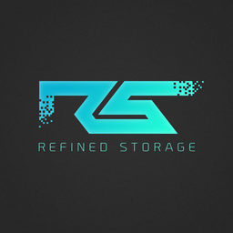

# Refined Storage — Reborn Initiative

> [!NOTE]
> This project serves as a part of Reborn Initiative. Its primary objectives are restoring compatibility with newer game versions, implementing multiplayer functionality, and generally avoiding introduction of radically new features. All rights to this project belongs to [bot17171661](https://github.com/bot17171661).

This mod will allow you to conveniently store all your items in a scalable system and access them in just 1 block. You can just as easily access these items using pipes or hoppers through the "Interface"
